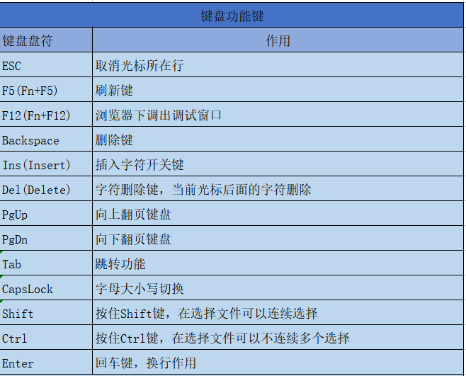
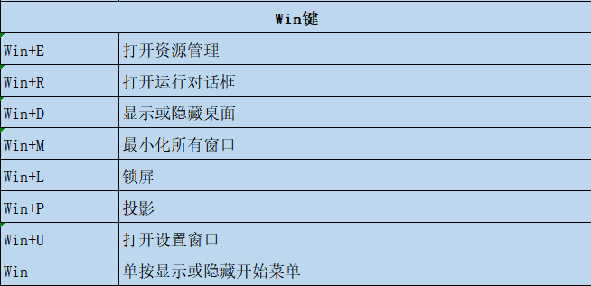
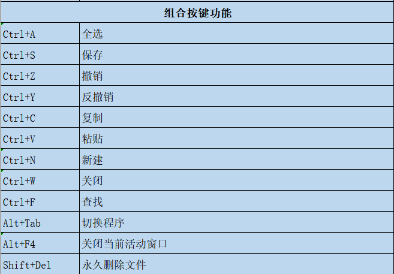
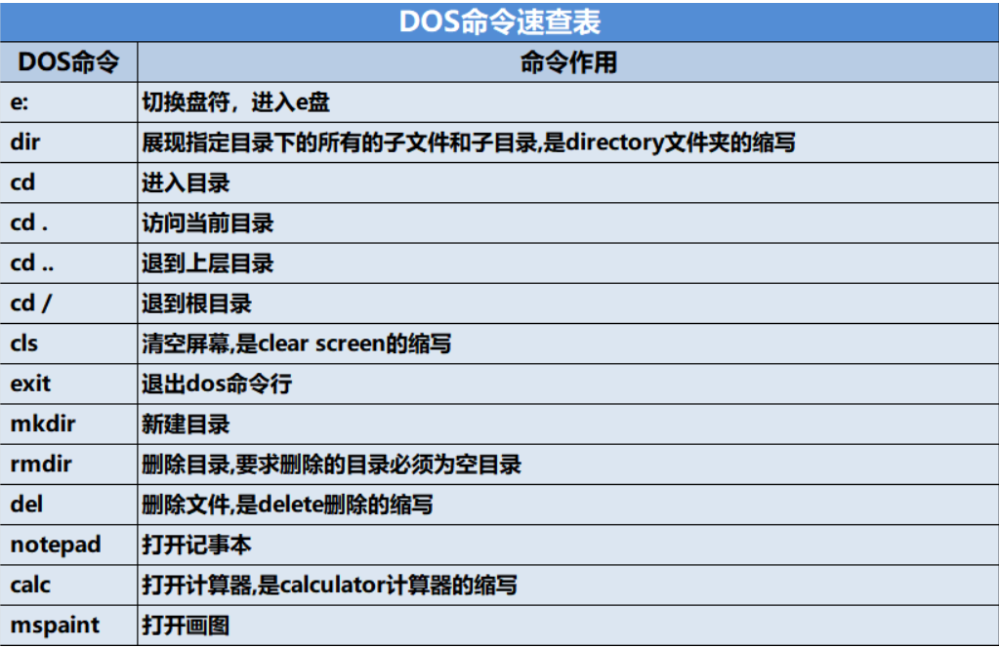
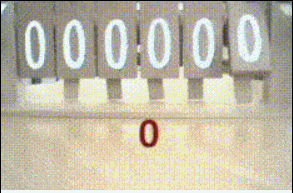
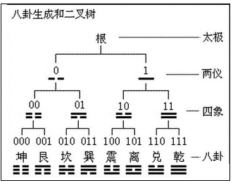
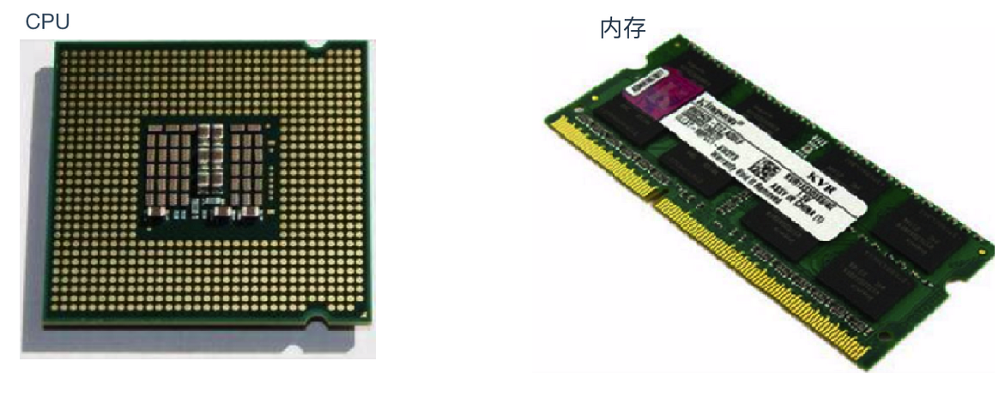

# 新手小白入门编程

**学习,分享,资料索取,进下面的群**

**(适合新手小白,院校毕设,java技能提升).**

群名称：IT学习从小白到高手高高手群

群  号：765326714

直播时间: 每周1,3,4,5(下午2-5和晚上7.30-10),周六上下午

直播地址: http://live.bilibili.com/22630275   

**(点进去就可以看,不花钱喔!)**

## 第1讲 计算机基础知识 

# 1.1 计算机

计算机（Computer）全称：电子计算机，俗称电脑。是一种能够按照程序运行，自动、高速处理数据的现代化智能电子设备。常见的形式有台式计算机、笔记本计算机。按照规模分为微型机、小型机、大型机、巨型机（超级计算机）等。

总结： 

计算机： 其实就是电脑，按照预先设定的程序去运行，自动，高速处理数据。

规模（体积，处理数据的速度）： 小的，大的，超级大的

最早的计算机发明者: 图灵, 建议买IT编程书籍时,图灵设计IT丛书

计算机发明者约翰•冯•诺依曼。计算机是20世纪最先进的科学技术发明之一，对人类的生产活动和社会活动产生了极其重要的影响，并以强大的生命力飞速发展。它的应用领域从最初的军事科研应用扩展到社会的各个领域，已形成了规模巨大的计算机产业，带动了全球范围的技术进步，由此引发了深刻的社会变革，计算机已遍及一般学校、企事业单位，进入寻常百姓家，成为信息社会中必不可少的工具。
计算机是由硬件系统和软件系统所组成，没有安装任何软件的计算机称为裸机。
计算机应用已渗透到社会的各个领域，正在改变着人们的工作、学习和生活的方式，推动社会发展。哪些方面?

### 1.2 计算机硬件系统

计算机= 硬件+软件

硬件： CPU、主板、内存、电源、主机箱、硬盘、声卡、显卡、网卡、键盘、鼠标，显示器等多个部件组成

软件： 硬件启动并且运行起来，需要安装对应的软件（驱动程序）

软件：

1. 系统软件
2. 应用软件

计算机是由硬件系统和软件系统所组成，没有安装任何软件的计算机称为裸机。
计算机硬件（Computer Hardware）是指计算机系统中由电子，机械和光电元件等组成的各种物理装置的总称。这些物理装置按系统结构的要求构成一个有机整体为计算机软件运行提供物质基础。
计算机硬件系统通常由CPU、主板、内存、电源、主机箱、硬盘、声卡、显卡、网卡、键盘、鼠标，显示器等多个部件组成(控制器, 运算器,存储器,输出设备,输入设备)。

计算机硬件系统有了,想要计算机运行,需要安装对应的软件系统.比如:  windows操作系统

总结: 

计算机硬件构成= **控制器**(cpu)+ **存储器**(内存和硬盘)+**运算器(**cpu+指令寄存器等等)+**输出设备**(显示器)+**输入设备**(键盘,鼠标,触摸板)

计算机= 硬件+ 软件

服务器(配置较高的电脑)=硬件+软件

### 1.3 计算机软件系统

计算机软件（Computer Software）是使用计算机过程中必不可少的程序，计算机软件可以使计算机按照事先预定好的顺序完成特定的功能。

* 软件： 开发者通过编程语言开发的程序。
* 作用： 让计算机按照软件预先设定的顺序去执行，实现软件既定的效果。

计算机软件按照其功能划分为系统软件与应用软件

    系统软件： DOS(Disk Operating System), Windows, Linux, Unix, Mac, Android, iOS,鸿蒙系统(华为手机), 塞班系统(诺基亚手机)
             是驱动硬件运行的, 是为计算机等设备运行提供服务的.
             系统软件为计算机服务的, 通过预装系统,从而让计算机启动和运行起来.
    应用软件：office,wps,  QQ, 英雄联盟, 王者荣耀等等
             是为计算机用户提供服务的.
    注意: 
    1. 计算机预装系统软件,比如: window10操作系统
    2. 计算机安装完系统软件后,才可以安装应用软件.

总结:

1. 计算机硬件不能脱离软件而存在,计算机根据软件设定的顺序,执行特定的功能.
2. 计算机的软件分为
   * 系统软件: 比如 手机Android的操作系统
   * 应用软件: 比如: 玩着荣耀需要安装在手机上

### 1.4 软件开发(开发的应用软件)

软件: 按照特定顺序组织的计算机数据和指令的集合

​		  通俗的来讲， 开发者通过编程语言编写的程序。

开发: 软件的制作过程
软件开发: 借助开发工具与计算机语言制作软件

软件开发: 

​		指的开发者 通过**计算机语言**,借助**开发工具**编写的应用程序的过程.

计算机语言: 指的计算机能够识别并且执行的"指令的集合"，

​				     通俗的来讲： 计算机语言指的用户通过计算机语言与计算机“交流沟通”。

开发工具:  指的开发者在编写程序的过程中,使用的应用软件(编写程序的软件)(工具)

### 1.5 计算机语言

语言: 人类进行沟通交流的各种表达符号，方便人与人之间进行沟通与信息交换
计算机语言:
人与计算机之间进行信息交流沟通的一种特殊语言

通俗的来讲,人通过计算机语言编写软件-----计算机语言----->可以在计算机上运行.

计算机语言中也有字符，符号等等
计算机语⾔通常分为三类：即机器语⾔，汇编语⾔和⾼级语⾔。

1. **机器语⾔**
   机器语⾔是⽤⼆进制代码表⽰的计算机能直接识别和执⾏的⼀种机器指令的集合。它是计算机的设计者通过计算机的硬件结构赋予计算机的操
   作功能。机器语⾔具有灵活、直接执⾏和速度快等特点。现在,除了计算机⽣产⼚家的专业⼈员外,绝⼤多数程序员已经不再去学习机器语⾔了。

   机器语言: 是用0和1 来编写代码, 表示计算机直接识别和执行的数据和指令的集合
   
   ​                  计算机默认使用的就是0好1机器语言.
   
   优点:   可以直接在计算机上运行,不用"翻译" , 比如: 中国人------->语言: 中国话-------------->中国人, 用户--->语言:计算机语言---->计算机
   
   缺点: 使用0和1 编写程序, 阅读性不强,  不便于后期的拓展以及维护(三难： 难于理解， 难与阅读，难于维护)
   
   总结：
   
   机器语言： 指的使用0和1编写程序。
   
   优点： 机器语言可以被计算机直接识别，把它称之为 主场语言， 使用灵活，执行效率高（比如： 篮球运动员主场打球）
   
   缺点： 程序阅读起来很困难。
   
2. **汇编语⾔**
     为了克服机器语⾔难读、难编、难记和易出错的缺点,⼈们就⽤与代码指令实际含义相近的英⽂缩写词、字母和数字等符号来取代指令代码(如⽤add表⽰运算符号“+”的机器代码),于是就产⽣了汇编语⾔。所以说,汇编语⾔是⼀种⽤助记符表⽰的仍然⾯向机器的计算机语⾔。汇编语⾔亦称符号语⾔。汇编语⾔由于是采⽤了助记符号来编写程序,⽐⽤机器语⾔的⼆进制代码编程要⽅便些,在⼀定程度上简化了编程过程。汇编语⾔像机器指令⼀样,是硬件操作的控制信息,因⽽仍然是⾯向机器的语⾔,使⽤起来还是⽐较繁琐费时,通⽤性也差。汇编语⾔是低级语⾔。但是,汇编语⾔⽤来编制系统软件和过程控制软件,其⽬标程序占⽤内存空间少,运⾏速度快,有着⾼级语⾔不可替代的⽤途。

     汇编语言： 主要是使用符号来替代机器语言的0和1 ，一定程度上解决机器语言难读，难记，难编等缺点

     ​                     它仍然是面向机器的语言，使用起来还是比较麻烦的。

     总结:

     机器语言和汇编语言
     
     共同点:
     
     1. 低级语言,都是面向机器的语言(编写程序时需要符合计算机的运行特点)
     2. 编写的程序都很难阅读,理解也很困难
     
     不同点:
     
     1. 汇编语言通常用于硬件编程(嵌入式编程)
     2. 汇编语言采用近义符号编写程序
     3. 机器语言就是使用0和1编程
     
3. **⾼级语⾔**
   不论是机器语⾔还是汇编语⾔都是⾯向硬件的具体操作的，语⾔对机器的过分依赖，要求使⽤者必须对硬件结构及其⼯作原理都⼗分熟悉，这对⾮计算机专业⼈员是难以做到的,对于计算机的推⼴应⽤是不利的。计算机事业的发展,促使⼈们去寻求⼀些与⼈类⾃然语⾔相接近且能为计算机所接受的语意确定、规则明确、⾃然直观和通⽤易学的计算机语⾔。这种与⾃然语⾔相近并为计算机所接受和执⾏的计算机语⾔称⾼级语⾔。

   高级语言: 采用符合用户习惯的语言,以及符合用户逻辑思维,以及能够被计算机所接收的语言.

   ⾼级语⾔是⾯向⽤户的语⾔。只需用⽆论何种机型的计算机,只要配备上相应的⾼级语⾔的编译或解释程序,则⽤该⾼级语⾔编写的程序就可以通⽤。

   比如: C,C++，Java,Python, Go, Ruby,C#,PhP，.Net等等

   Java语言主要应用在互联网程序的开发领域。常见的互联网程序比如天猫、京东、物流系统、网银系统等，以及服务器后台处理大数据的存储、查询、数据挖掘等也有很多应用。

   高级语言:  用户比较习惯的字母ABC-Dabc-d1-9等符号构成,比如: name="张三"

   计算机默认识别的语言是0和1, 高级语言显然不是0和1 ,高级语言怎么在计算机运行呢?

   高级语言编写的程序--------------------> 编译: 高级语言(中国话)编译成0和1(机器语言)(韩国话)-------------->计算机运行
   
(中国人)-------------------------------------> 高级语言(中国话) 翻译: 机器语言(韩国话)------------------------------>(韩国)
   
高级语言缺点:
   
不能直接在计算机运行,需要编译, 所以高级语言编写的程序运行效率低.
   
高级语言: C, C++, .Net, Python, Go,Java等等
   
   我们多学的就是通过java语言编程, 提供应用服务.
   
   比如: 物流行业, 智能家居行业, 电商行业,餐饮行业,建筑行业, 农林行业等等

### 1.6 人机交互方式(人操作计算机的方式)

软件的出现实现了人与计算机之间更好的交互,主要的交互方式有两种:
图形化界面：这种方式简单直观，使用者易于接受，容易上手操作。
命令行方式：需要有一个控制台，输入特定的指令，让计算机完成一些操作。较为麻烦，需要记录住一些命令。

总结:

图形化界面对应的系统: windows系列,  Linux图形化界面等等

​									     用户通过点击图标或者链接或者快捷方式操作计算机, 更容易上手.

命令行界面对应的系统: 早期的windows系统, linux, unix等等

​									     用户通过输入命令操作计算机,操作比较麻烦,需要记住一些命令

历史：

最早的时候，都是通过输入命令来操作计算机，后来考虑到用户的习惯，才发明类图形化操作方式。

比如： 

windows系统：  windows的dos命令行系统-， win95, win98 ---win11

unix, linux 早期都是命令行操作。

### 1.7 键盘功能键及快捷键介绍

想入门编程,首先你需要了解的就是键盘,以下内容你了解吗?不了解的话,就从这里开始吧!
键盘盘符功能键: 				

~

键盘盘符win:

~

组合键:

~

### 1.8 常见的DOS命令

之前都是图形化界面来操作,现在我们来尝试一下通过命令的方式操作计算吧!
同时按”Window+R”键,在弹窗输入”cmd”,回车进入DOS窗口,即可开始练习~
注意: 进入后默认是在c盘下，最好不要操作系统盘 , 可以切换盘符
DOS命令速查表

### 1.9 计算规则

* 二进制介绍

  二进制（binary），发现者[莱布尼茨](https://baike.baidu.com/item/莱布尼茨/417549)，是在[数学](https://baike.baidu.com/item/数学/107037)和[数字电路](https://baike.baidu.com/item/数字电路/1705)中以2为基数的记数系统，是以2为基数代表系统的二进位制。这一系统中，通常用两个不同的符号0（代表零）和1（代表一）来表示 [1] 。数字[电子电路](https://baike.baidu.com/item/电子电路/2566586)中，[逻辑门](https://baike.baidu.com/item/逻辑门/5141155)的实现直接应用了二进制，现代的[计算机](https://baike.baidu.com/item/计算机/140338)和依赖计算机的设备里都使用二进制。每个数字称为一个[比特](https://baike.baidu.com/item/比特/3431582)（Bit，Binary digit的缩写), 各位看官,看好了是一个1Bit, 而不是1Byte(其实1Byte=8Bit)

  计算机计量单位：

  						1. 计算机最小的单位是位，表示0或者1（1个数字就是一位）
     						2. 计算机最小的存储单位是字节(Byte): 1Byte=8Bit

  计算机语言: 二进制(0和1构成)

  bit是计算机的最小单位, 称之为位.

  1Byte = 8Bit(位)

  1KB=1024Byte

  1MB=1024KB

  1G=1024MB

  1T= 1024G

  1PB = 1024T

* 计算机为什么使用二进制进行计算?

  十进制是永远都没有十这样一个数字！

  0，1，2，3，4，5，6，7，8，9(构成了10进制, 逢10进1)

  9之后就没有一个单独的数字来表达十了，而是有1、0组成。同样的道理，二进制永远没有二，只有0跟1，下面这张图，很好的演示了什么是二进制。

  

  

**那么为什么电脑的世界是二进制呢？** 

**回答这个问题就要回答为何人类的世界是十进制，因为人类天生有十个手指，自然也就有了十进制。**

同样的，计算机设计之初，冯诺依曼根据电子元件双稳工作的特点，在电子计算机中采用二进制,0表示负极(或者关),1表示正极(或者开)。也就是说，至今为止，人类只能用电子元件的两种状态来设计计算机，如果将来人类能找到其他的解决方案来更好的表达更多的状态，说不定也会有变化呢。

**还有一个说法呢,**[电子计算机](https://baike.baidu.com/item/电子计算机/191373)出现以后，使用[电子管](https://baike.baidu.com/item/电子管/913264)来表示十种状态过于复杂，所以所有的电子计算机中只有两种基本的状态，开和关。也就是说，电子管的两种状态决定了以电子管为基础的电子[计算机](https://baike.baidu.com/item/计算机)采用二进制来表示数字和数据。常用的进制还有8进制和16进制，在电脑科学中，经常会用到16进制，而十进制的使用非常少，这是因为16进制和二进制有天然的联系：4个二进制位可以表示从0到15的数字，这刚好是1个16进制位可以表示的数据，也就是说，将二进制转换成16进制只要每4位进行转换就可以了。

**但是也不必担心**,同二进制数一样，二进制编码也是计算机内部用来表示信息的一种手段，人们平时和计算机打交道时，根本不用理它。我们仍然用人们习惯的方式输入或者输出信息，期间的转换则由计算机自动去完成。

二进制:  0, 1 逢2进1

十进制:  0,1,2,3,4,5,6,7,8,9,逢10进1

八进制:  0,1,2,3,4,5,6,7, 逢8 进1

十六进制:  0,1,2,3,4,5,6,7,8,9, A,B,C,D,E,F

进制之间怎么转换? 在这里介绍 二进制和10进制的转换.

二进制--->十进制:  从最右侧开始,由二进制数字乘以2的次幂,次幂依次加1, 最终使用2的次幂相加得到的和就是10进制的数字.

十进制(整数)---->二进制: 10进制的整数除以2,继续使用商除以2 ,直到商小于2,不在整除了,把上面经过除法运算得到的余数,从最低位向上组合,得到二进制数.

中国的古老易经文化中，也有二进制的痕迹：

二进制最适合逻辑运算，它只有两个数码，正好与逻辑代数中的“真”和“假”相吻合。二进制两个数码正好与逻辑命题中的“真（True）”、“假（False）”或称为”是（Yes）”、“否（No）”相对应。这个世界原本没有那么复杂，有了人类，才变得复杂，不是么？

* 计算机的硬件构成与二进制的关系

  计算机内部是由IC(Integrated Circuit)电子元件组成的，其中 `CPU` 和 `内存` 也是 IC 电子元件的一种，CPU和内存图如下:

  

IC元件两侧排列的四方形块就是引脚，IC的所有引脚，只有两种电压: 0V 和 5V，IC的这种特性，也就决定了计算机的信息处理只能用 0 和 1 表示，也就是二进制来处理。一个引脚可以表示一个 0 或 1 ，所以二进制的表示方式就变成 0、1、10、11、100、101等，虽然二进制数并不是专门为 引脚 来设计的，但是和 IC引脚的特性非常吻合。

至于二进制,八进制,十进制,十六机制的转换,在这里我们不用过多的讨论.

# 